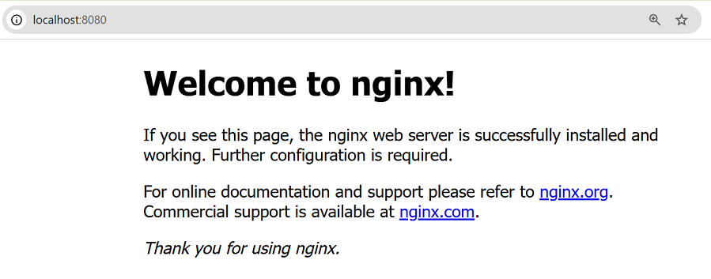
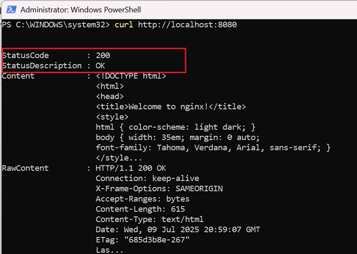
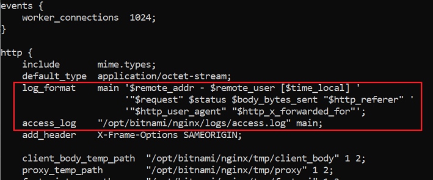
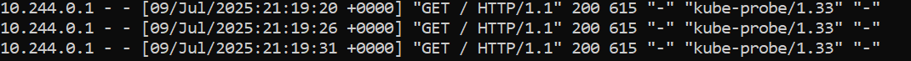
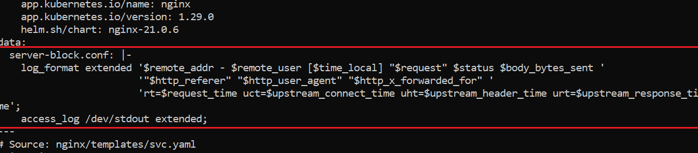
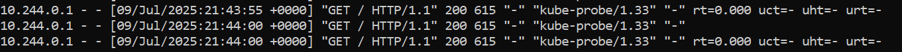
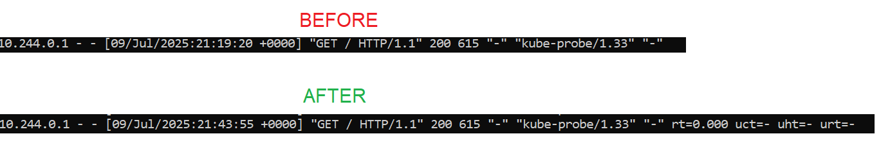

# Test Assignment

In this topic, you will learn how to apply custom NGINX settings to a running pod by modifying and upgrading its Helm chart.

## Prerequisites
* The host machine is running Windows 10 or later.
* [Docker Desktop for Windows](https://docs.docker.com/desktop/setup/install/windows-install/) is installed.
* The [Chocolatey](https://chocolatey.org/install) package manager is installed.

## Step 1: Setting Up the Environment

1. Open Windows PowerShell as Administrator.
2. Install Minikube:
```powershell
winget install Kubernetes.Minikube
```
3. Start Minikube. This will also install Kubernetes.
```powershell
minikube start
```
4. Install Helm:
```powershell
choco install kubernetes-helm -y
```
5. Check that the Kubernetes version is 1.23 or later:
```powershell
kubectl version
```
6. Check that the Helm version is 3.8.0 or later:
```powershell
helm version
````
Step one done! Everything is now set up to continue deploying NGINX from a Helm chart.

## Step 2: Deploying NGINX and Verifying the Deployment

1. Download and unzip the [Bitnami NGINX Open Source Helm chart](https://artifacthub.io/packages/helm/bitnami/nginx):
```powershell
helm pull oci://registry-1.docker.io/bitnamicharts/nginx --untar
```
**Note:** Unlike the [Bitnami instructions](https://artifacthub.io/packages/helm/bitnami/nginx), we will first use `helm pull` instead of `helm install` because we need to download the Helm chart to edit it later.
 
2. Deploy NGINX from the downloaded Helm chart and name the deployment `my-nginx`:
```powershell
helm install my-nginx ./nginx
```
3. Start a background PowerShell session and set up port forwarding from port 8080 on your machine to port 80 on the Kubernetes service `my-nginx`:
```powershell
Start-Process powershell -ArgumentList "kubectl port-forward svc/my-nginx 8080:80"
```
**Note:** We are running the command above in the background because otherwise it will hold the terminal session.

4. Open `http://localhost:8080/` in your browser. If the NGINX service was deployed correctly, you will see the NGINX start page.

5. Let’s verify the deployment in another way. Return to PowerShell and run the following command:
 
```powershell
curl http://localhost:8080
```
If the NGINX service was deployed correctly, you will receive an HTTP 200 response.


All set! We can now take a closer look at the NGINX settings.

## Step 3: Checking the Default NGINX Logging Level
1. Find the name of the NGINX pod running in your Minikube cluster:
```powershell
kubectl get pods
```
2. Open an interactive shell inside the NGINX pod:
```powershell
kubectl exec -it <POD_NAME> -- bash
```
3. Display the NGINX configuration:
```bash
nginx -T
```
4. Take a closer look at the output of the previous command. Locate the `log_format` and `access_log` directives.


5. Judging from them, the NGINX logging level is set to default. But let's confirm by inspecting the NGINX logs:
```powershell
kubectl logs <POD_NAME>
```
The format of the log entries confirms that the logging level is default.

Let's change it to extended.

## Step 4: Changing the NGINX Logging Level to Extended
1. Locate the `nginx` directory of the downloaded and unzipped Helm chart. By default, Helm saves chart files in the current directory where you ran the command.
2. Open the `nginx` directory and create a file named `custom-values.yaml`.

**Note:** It is not mandatory to create this file inside the Helm chart directory, but we will do so to make running an upcoming command more convenient.

3. Open the `custom-values.yaml` file, add the following lines, and then save the file:
```yaml
serverBlock: |-
  log_format extended '$remote_addr - $remote_user [$time_local] "$request" $status $body_bytes_sent '
                      '"$http_referer" "$http_user_agent" "$http_x_forwarded_for" '
                      'rt=$request_time uct=$upstream_connect_time uht=$upstream_header_time urt=$upstream_response_time';
  access_log /dev/stdout extended;
```
4. Upgrade the Helm release and the running pod by overriding the default NGINX settings with the custom ones defined in the `custom-values.yaml` file:
```powershell
helm upgrade my-nginx ./nginx -f ./nginx/values.yaml -f ./nginx/custom-values.yaml
```
The pod was upgraded. Let's now check that the custom NGINX settings were applied.

5. Inspect the full Kubernetes manifest Helm has generated and applied for `my-nginx`:
```powershell
helm get manifest my-nginx
```
6. Locate the `log-format` and `access-log` directives:

As you can see, the NGINX logging level was changed to extended. But let's double-check it by looking at the NGINX logs.
7. Find the name of the NGINX pod running in your Minikube cluster:
```powershell
kubectl get pods
```

**Note:** The step above is necessary because upgrading the Helm release and the pods under it also changes the pod names.
 
8. Inspect the NGINX logs:
```powershell
kubectl logs <POD_NAME>
```
The format of the log entries confirms that the new logging level is set to extended:


Congratulations! You have changed the NGINX logging level from `default` to `extended` on the running pod by upgrading the Helm chart.

